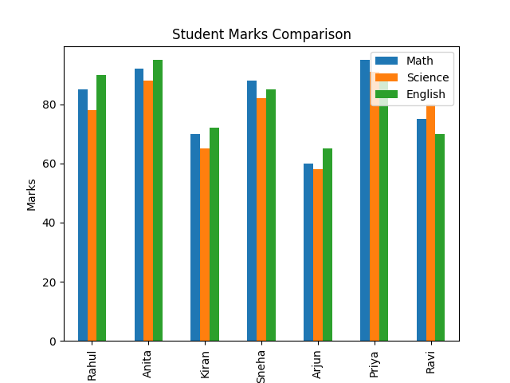
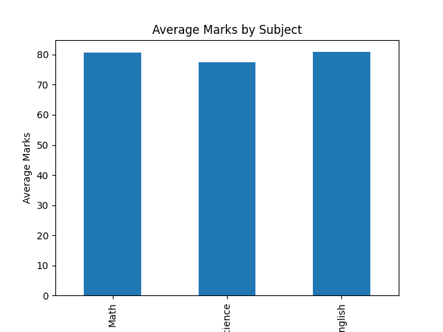

# Student-Performance-Analysis

## Project Description
This project analyzes student performance using Python and Pandas.  
It calculates average marks, identifies top-performing students, and visualizes subject-wise performance.

## Tools Used
- Python
- Pandas
- Matplotlib

## Dataset
The dataset contains marks of students in three subjects:
- Math
- Science
- English

## Features
- Calculate average marks
- Identify top-performing student
- Compare subject performance
- Visualize marks using bar charts

## Output
The project generates charts to show the comparison of student marks across subjects.

## Key Insights

1. The average Math score of students is higher than Science.
2. Priya is the top performing student with the highest total marks.
3. English subject has consistent performance across students.
4. Arjun has the lowest scores and may need academic support.

## Conclusion

The analysis shows that most students perform better in English compared to Science.  
Teachers can focus more on improving Science understanding to increase overall academic performance.

## Visualizations

### Student Marks Comparison

### Subject Average Comparison

